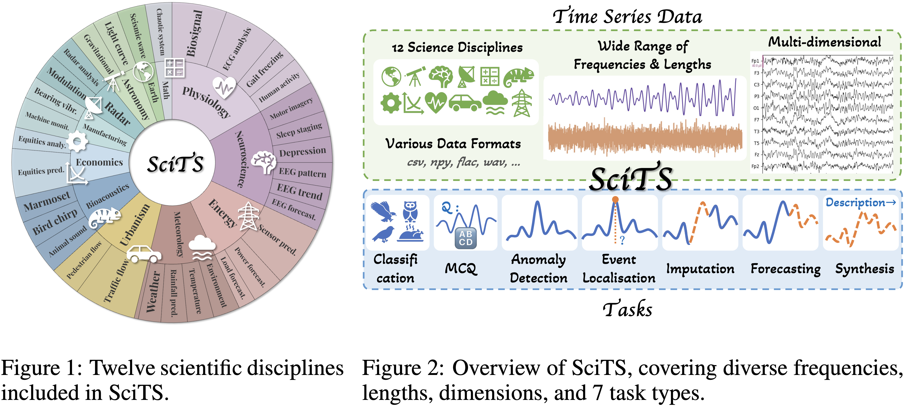
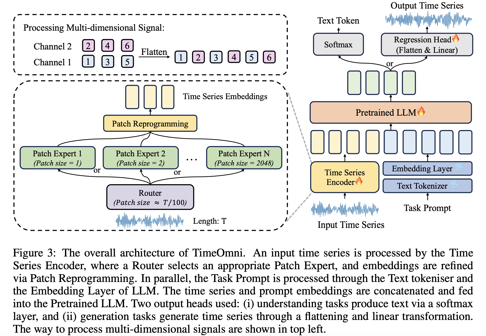

# SciTS: Scientific Time Series Understanding and Generation with LLMs (TimeOmni)

[](https://arxiv.org/abs/2510.03255)
[](LICENSE)
[](https://pytorch.org/)
[](https://github.com/huggingface/transformers)
[](https://huggingface.co/datasets/OpenTSLab/SciTS)

**🎉 Accepted to ICLR 2026**

**📢 The SciTS benchmark dataset and baseline evaluation scripts are available [here](https://huggingface.co/datasets/OpenTSLab/SciTS).**

**This is the official SciTS (TimeOmni) repository.**

> **SciTS** is a large-scale benchmark for scientific time series understanding and generation across 12 domains and 43 tasks. **TimeOmni** is a unified framework that equips LLMs with the ability to understand and generate time series while staying compatible with general-purpose LLM training.

---

## ✨ Highlights

- **Unified time series modeling** across forecasting, classification, anomaly detection, QA, and more.
- **LLM-compatible** training pipeline with reprogramming layers.
- **Benchmark-ready** evaluation with standardized JSONL formats.
- **Multimodal time series** support (audio, CSV, NumPy, EEG/MEG .fif).

---

## 🖼️ Figures

<p align="center">
  
</p>
<p align="center"><em>Figure 1. SciTS benchmark overview.</em></p>

<p align="center">
  
</p>
<p align="center"><em>Figure 2. TimeOmni framework.</em></p>

---

## 📦 Repository Structure

```
TimeOmni/
├── run_main_refactored_unified.py   # Main training entry
├── infer_benchmark.py               # Distributed inference for JSONL files
├── eval_benchmark.py                # Metric evaluation & aggregation
├── models/                          # TimeOmni model definition
├── layers/                          # Embedding & normalization modules
├── data_provider/                   # Dataset + dataloader factory
├── scripts/                         # Training & inference scripts
├── utils/                           # Helper utilities (early stop, lr schedule, etc.)
├── dataset/                          # Place datasets here (JSONL + raw signals)
├── pretrained/                       # Place pretrained LLM weights here
├── figures/                          # Paper figures
└── ds_config_zero2.json              # DeepSpeed ZeRO-2 config
```

---

## 🚀 Quick Start

### 1) Environment

Use python 3.11 from MiniConda.
Install dependencies:

```bash
pip install -r requirements.txt
```

### 2) Prepare Data

- Place JSONL datasets under `dataset/`.
- Each JSONL line should contain fields required by `Dataset_Unified` (see `data_provider/dataset.py`).
- For raw signals, use supported formats: `.wav`, `.mp3`, `.flac`, `.m4a`, `.csv`, `.npy`, `.fif`.

### 3) Pretrained LLM

Put the pretrained weights under `pretrained/`. Default configuration expects:

```
pretrained/Qwen3-8B/
```

### 4) Train

Use the provided multi-node training script or call the main training entry directly:

```bash
bash scripts/TimeOmni_unified.sh
```

### 5) Inference & Evaluation

```bash
bash scripts/TimeOmni_infer_eval.sh
```

---

## 🧠 Core Components

- **Training**: `run_main_refactored_unified.py` (Accelerate + DeepSpeed)
- **Model**: `models/TimeOmni.py`
- **Dataset**: `data_provider/dataset.py` and `data_provider/data_factory_unified.py`
- **Benchmark Inference**: `infer_benchmark.py`
- **Benchmark Evaluation**: `eval_benchmark.py`

---

## ⚙️ Configuration

- **DeepSpeed**: `ds_config_zero2.json`
- **Training hyperparameters** are specified in `scripts/TimeOmni_unified.sh`.
- **Inference & evaluation** are configured in `scripts/TimeOmni_infer_eval*.sh`.

---

## 📈 Output Artifacts

Training and evaluation outputs are saved under `exp/`, including:

- `config.json` (experiment configuration)
- `training_log.txt`
- `infer_results/` (JSONL outputs)
- `eval_results/` (CSV metrics)

---

## 🙏 Acknowledgement

This codebase is adapted from [KimMeen/Time-LLM](https://github.com/KimMeen/Time-LLM). Thanks to the authors for their excellent work.

---

## 📜 Citation

If you find this work useful, please cite:

```bibtex
@inproceedings{wu2025scits,
    title={{SciTS: Scientific Time Series Understanding and Generation with LLMs}}, 
    author={Wu, Wen and Zhang, Ziyang and Liu, Liwei and Xu, Xuenan and Liu, Junlin and Fan, Ke and Lv, Qitan and Zhuang, Jimin and Zhang, Chen and Yuan, Zheqi and others},
    booktitle={Proc. ICLR},
    year={2026},
    address={Rio de Janeiro}
}
```

---

## 📄 License

This project is licensed under the Apache 2.0 License. See [LICENSE](LICENSE) for details.
